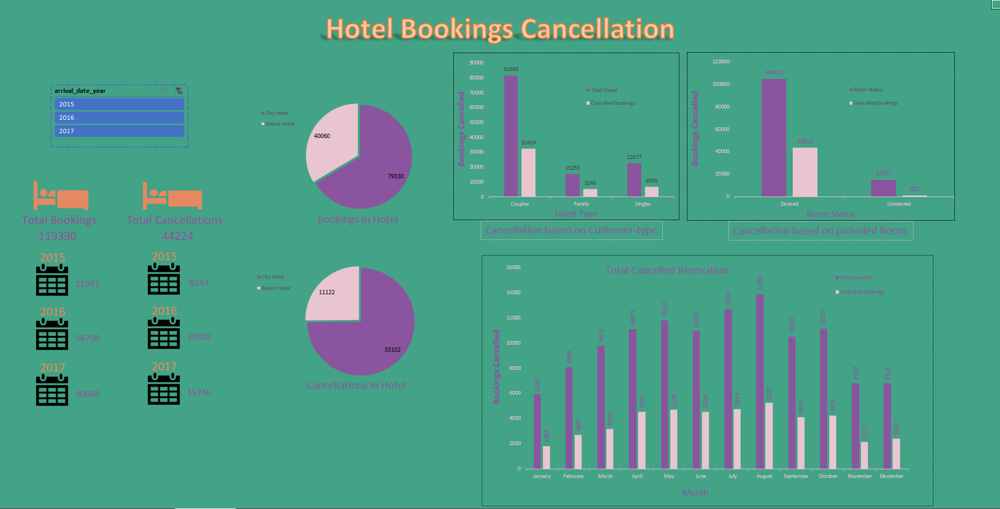

# 🏨 Hotel Booking Cancellation Dashboard

This project analyzes hotel booking cancellation patterns using an Excel dashboard. The goal is to identify trends behind booking cancellations across different customer segments, times of year, and booking types.

## 📁 Project Structure

- `Raw_data.csv` – Raw dataset used for analysis.
- `Hotel-Booking-Dashboard.xlsx` – Final dashboard with pivot tables, slicers, and visuals.
- `Dashboard.png` – Snapshot of the final dashboard.

## 📊 Dashboard Features

- 🔹 Monthly cancellation trends  
- 🔹 Customer type (e.g., Family vs Couples)
- 🔹 Cancellation on Room changed
- 🔹 Visual slicers for flexible data filtering

## 🛠️ Tools Used

- **Microsoft Excel**
  - Pivot Tables
  - Slicers
  - Power Query
  - Conditional Formatting
  - Dashboard Layout

## 📌 Objective

To help hotel managers identify patterns that lead to booking cancellations and make data-driven decisions to reduce cancellations and improve customer satisfaction.

## 📷 Screenshot

## 📬 Feedback

Feel free to fork the repo, suggest improvements, or open issues!
